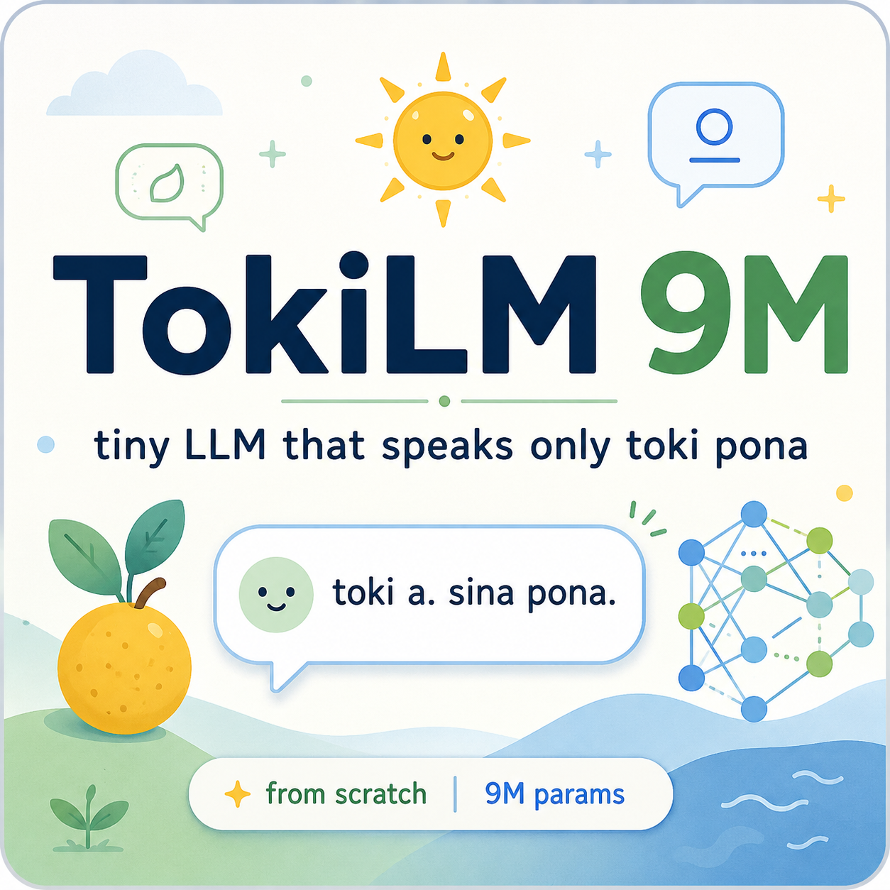

# TokiLM

<p align="center">
  
</p>

<p align="center"><em>A ~9M parameter LLM that speaks Toki Pona.</em></p>

<p align="center">
  <a href="https://huggingface.co/datasets/finnnnnnnnnnnn/toki-pona-sentences"></a>&nbsp;
  <a href="https://huggingface.co/Grizzlykw/tokilm-9m-chat"></a>&nbsp;
  <a href="https://github.com/skorotkiewicz/tokilm/blob/main/LICENSE"></a>
</p>

---

> **This project exists to show that training your own language model is not magic.**
> No PhD required. No massive GPU cluster. A small repo, a few minutes on a T4 GPU, and you have a working LLM that you built from scratch — data prep, tokenizer, model architecture, training loop, and inference. If you can run a script, you can train a language model.
>
> It won't write essays. But it will show you exactly how every piece works — from raw text to trained weights to generated output — so the big models stop feeling like black boxes.

---

```
You> toki
TokiLM> toki a. sina pona. mi wile toki pona.

You> moku li pona
TokiLM> moku li pona tawa mi. mi moku e kili.

You> sina pilin seme
TokiLM> mi pilin pona. mi lukin e suno.
```

---

## What is TokiLM?

TokiLM is a tiny language model that speaks [Toki Pona](https://en.wikipedia.org/wiki/Toki_Pona) — a minimalist constructed language with ~120 root words. It generates short, simple sentences, one token at a time.

It's trained from scratch on the [finnnnnnnnnnnn/toki-pona-sentences](https://huggingface.co/datasets/finnnnnnnnnnnn/toki-pona-sentences) corpus, runs on a single GPU in ~5 minutes, and produces a model small enough to run in a browser.

---

## Architecture

| | |
|---|---|
| **Parameters** | 8.7M |
| **Layers** | 6 |
| **Hidden dim** | 384 |
| **Heads** | 6 |
| **FFN** | 768 (ReLU) |
| **Vocab** | 4,096 (BPE) |
| **Max sequence** | 128 tokens |
| **Norm** | LayerNorm |
| **Position** | Learned embeddings |
| **LM head** | Weight-tied with embeddings |

Vanilla transformer. No GQA, no RoPE, no SwiGLU, no early exit. As simple as it gets.

---

## Quick Start

### Chat locally

```bash
pip install torch tokenizers
python -m tokilm chat --prompt "toki"
```

Or interactively:

```bash
python -m tokilm chat
```

```
You> sina pona
TokiLM> pona. sina pilin seme.
```

### Train your own

```bash
python -m tokilm prepare   # download corpus + train BPE tokenizer -> data/
python -m tokilm train     # train for 10k steps -> checkpoints/
```

With [uv](https://github.com/astral-sh/uv):

```bash
uv run python -m tokilm prepare
uv run python -m tokilm train --device cuda --max-steps 10000
uv run python -m tokilm chat --checkpoint checkpoints/final_model.pt --tokenizer data/tokenizer.json --prompt "toki"
```

Quick smoke run:

```bash
uv run python -m tokilm prepare --n-samples 64 --data-dir data
uv run python -m tokilm train --max-steps 1 --data-dir data --output-dir .smoke-checkpoints --device cpu
```

---

## Export

Export a trained checkpoint for sharing or browser inference:

```bash
python tools/export_model.py --repo Grizzlykw/tokilm-9m-chat --token hf_xxx   # HuggingFace: pytorch_model.bin + config.json + tokenizer.json
python tools/export_onnx.py --push                                          # ONNX (quantized uint8) for onnxruntime-web
python tools/export_dataset.py --repo your-username/tokilm-data --token hf_xxx  # push prepared data/*.jsonl to HF
```

Set `HF_TOKEN` and `HF_REPO` (and `HF_DATASET`) in `.env` to avoid passing flags.

---

## Dataset

**[finnnnnnnnnnnn/toki-pona-sentences](https://huggingface.co/datasets/finnnnnnnnnnnn/toki-pona-sentences)** on HuggingFace — a corpus of Toki Pona sentences.

| | |
|---|---|
| Source | Toki Pona sentence collection |
| Format | `{"text": "<|im_start|>assistant\n...<|im_end|>"}` (one JSON object per line) |
| Preparation | `python -m tokilm prepare` wraps each sentence as a single assistant turn and trains a 4096-token BPE tokenizer |

```python
from datasets import load_dataset
ds = load_dataset("finnnnnnnnnnnn/toki-pona-sentences")
print(ds["train"][0])
```

---

## Project Structure

```
tokilm/
├── config.py               Hyperparameters (model + training)
├── model.py                Vanilla transformer
├── dataset.py              Data loading + batching
├── train.py                Training loop (cosine LR, AMP)
├── eval_cases.py           Held-out test cases
├── prepare_data.py         Data prep + tokenizer training
└── inference.py            Chat interface

tools/
├── make_colab.py           Generates Colab notebooks (train_tokilm.ipynb, use_tokilm.ipynb)
├── export_onnx.py          Export model to ONNX (quantized uint8)
├── export_model.py         Export model to HuggingFace format
└── export_dataset.py       Push prepared data to HuggingFace
```

---

## Design Decisions

**Why no system prompt?** Every training sample has the same format. A 9M model can't conditionally follow instructions — the language is baked into the weights. Keeping the prompt minimal saves tokens per inference.

**Why single-turn only?** Multi-turn degrades at turn 3-4 due to the 128-token context window. Single-turn is reliable.

**Why vanilla transformer?** GQA, SwiGLU, RoPE, and early exit add complexity that doesn't help at 9M params. Standard attention + ReLU FFN + LayerNorm produces the same quality with simpler code.

**Why Toki Pona?** A tiny vocabulary and simple grammar are a good fit for a tiny model — it can actually learn the language within 10k steps on a single GPU.

---

## License

MIT

---

## Credits

TokiLM is based on [GuppyLM](https://github.com/arman-bd/guppylm) by Arman Hossain — a from-scratch tiny LLM tutorial. The model architecture, training loop, and tooling follow GuppyLM, retargeted to speak Toki Pona.
